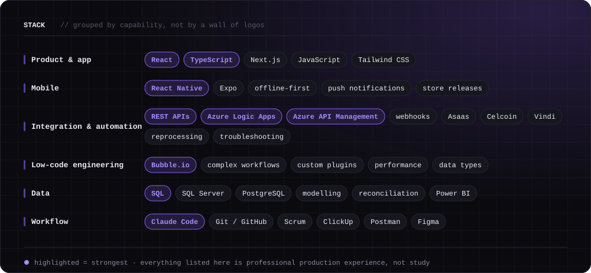

<div align="center">
  <picture>
    <source media="(prefers-color-scheme: dark)" srcset="./assets/header-en-dark.svg" />
    <source media="(prefers-color-scheme: light)" srcset="./assets/header-en-light.svg" />
    
  </picture>
</div>

<p align="center">
  <a href="https://igorsantos.dev/"></a>
  <a href="https://www.linkedin.com/in/igor-santos11"></a>
  <a href="mailto:igor.santos@mpdsconsultoria.com"></a>
  <a href="./README.md"></a>
  &nbsp;
  <a href="./.github/workflows/veracity.yml"></a>
  <a href="./.github/workflows/profile-assets.yml"></a>
</p>

---

## `whoami`

For 5 years I've been building and maintaining **real systems in production**, at the intersection of product, integrations, automation and business. None of this is a weekend prototype: it's software that has to come up on Monday morning, with money flowing through it.

I've worked on high-criticality enterprise and financial systems — commission splits, receivables anticipation, tax document issuance, banking integrations, recurring billing — and through enterprise sales channels such as **Itaú, Unimed, Assaí and Pluxee**. In that context a broken integration or a mismatched record has real financial impact. So a large part of my job happens **before** the code: understanding the business, talking to the teams, prioritising, and keeping alive what already runs.

```yaml
where:       São Paulo, Brazil 🇧🇷
now:         Partner @ MPDS · Software Engineer
strongest:   Bubble.io · Azure (Logic Apps + APIM) · REST APIs · SQL · React / React Native
studying:    B.Sc. Software Engineering @ Universidade São Judas Tadeu
certified:   AZ-900 · Bubble.io Specialist · Scrum Foundation · Databases (SQL)
open to:     Software Engineer · React / React Native · Integration · Automation · Solutions
```

---

## What I build

The same shape repeats across nearly every project of mine: **product at the edge, an integration layer in the middle, money and data at the end.** That slice of the map is the one I know well.

<div align="center">
  <picture>
    <source media="(prefers-color-scheme: dark)" srcset="./assets/integrations-en-dark.svg" />
    <source media="(prefers-color-scheme: light)" srcset="./assets/integrations-en-light.svg" />
    
  </picture>
</div>

---

## Stack

<div align="center">
  <picture>
    <source media="(prefers-color-scheme: dark)" srcset="./assets/stack-en-dark.svg" />
    <source media="(prefers-color-scheme: light)" srcset="./assets/stack-en-light.svg" />
    
  </picture>
</div>

> This list has **CI**. A workflow in this repository fails the build if the README presents as professional experience anything that, in my career, was only study or a brief encounter. See [`scripts/check-veracity.mjs`](./scripts/check-veracity.mjs).

---

## Projects

<table>
<tr><td width="50%" valign="top">

### [Pipeimob](https://igorsantos.dev/en/projects/pipeimob)
**Real-estate transaction platform wired into a digital bank**

Brazil's first TRM platform integrated with a digital bank — 400+ real-estate agencies across 13 states. I worked in two squads:

- **Banking** — commission splits, receivables anticipation and tax document issuance on a product moving R$ 40MM/month in commissions, where a mistake is a loss, not a bug.
- **Rentals** — end-to-end TRM: contracts, recurring billing, receipts and invoices, with integrations approved by notary offices in four states.

`Bubble.io` `custom plugins` `REST APIs` `Asaas` `Celcoin`

</td><td width="50%" valign="top">

### [APet](https://igorsantos.dev/en/projects/apet)
**Enterprise sales portal + Azure automation**

Pet health plan. I joined as a developer and became the first permanent hire for an IT function that barely existed.

- Led **SAV** (SaaS sales portal) end to end, used by partners such as Itaú, Unimed, Assaí and Pluxee.
- Integrations and automation on **Logic Apps + API Management**, meeting the security bar a bank requires — that is what got the channel approved.
- Power BI replaced spreadsheet reporting with a single view of sales, finance and reimbursements.

`Bubble.io` `Azure` `SQL` `Power BI` `Vindi` `Scrum`

</td></tr>
<tr><td width="50%" valign="top">

### [ECEM](https://igorsantos.dev/en/projects/ecem)
**Peer mentoring · volunteer**

Free tutoring that started among ETEC students during the pandemic and grew into a multi-course project backed by EACH USP. Co-founder, student mentor and tutor: classes on programming logic and development, coding contests and one-on-one follow-up.

`teaching` `programming logic` `JavaScript`

</td><td width="50%" valign="top">

### [igorsantos.dev](https://igorsantos.dev/en)
**Bilingual portfolio**

Next.js 16 + React 19, Tailwind v4, PT/EN i18n, animation with Motion and GSAP, Lenis, and a Lighthouse 95+ budget across every category. Every project has its own written case study.

`Next.js` `React` `TypeScript` `Tailwind` `next-intl`

</td></tr>
</table>

---

## GitHub by the numbers

<div align="center">
  <picture>
    <source media="(prefers-color-scheme: dark)" srcset="./assets/stats-en-dark.svg" />
    <source media="(prefers-color-scheme: light)" srcset="./assets/stats-en-light.svg" />
    
  </picture>
  <br /><br />
  <picture>
    <source media="(prefers-color-scheme: dark)" srcset="./assets/activity-en-dark.svg" />
    <source media="(prefers-color-scheme: light)" srcset="./assets/activity-en-light.svg" />
    
  </picture>
</div>

> **On the 2026 start date:** I lost access to my previous GitHub account, and the projects living there went with it. This profile's history starts in February — the 5 years of work don't. The dashed line in the graph above marks that point.

> **On the near-empty shop window:** the overwhelming majority of my code lives in private client repositories — financial systems, an enterprise sales portal, banking integrations. I can't open those, and I'd rather be honest about it than pad the profile with forks. What I can show is at **[igorsantos.dev](https://igorsantos.dev/en)**, with a written case study for each.

<div align="center">
  <picture>
    <source media="(prefers-color-scheme: dark)" srcset="https://raw.githubusercontent.com/igorpdsantos/igorpdsantos/output/github-contribution-grid-snake-dark.svg" />
    <source media="(prefers-color-scheme: light)" srcset="https://raw.githubusercontent.com/igorpdsantos/igorpdsantos/output/github-contribution-grid-snake.svg" />
    
  </picture>
</div>

---

## How I work

<details>
<summary><b>🤖 AI-assisted software engineering</b> — how I actually use Claude Code</summary>

<br />

I use **Claude Code** daily as part of my engineering workflow: codebase exploration, planning, implementation, debugging, refactoring, testing and documentation.

What that does **not** mean: I don't present myself as an AI Engineer, an ML Engineer or an LLM specialist. I don't train models, I don't fine-tune, I don't build AI infrastructure.

What it **does** mean: responsibility for the solution, the validation and the delivery stays with me. The tool speeds up typing and reading code; it doesn't carry the risk of a commission split going out wrong. This repository is an example — the panels above are SVGs produced by scripts I maintain, with a veracity CI sitting on top of the prose.

</details>

<details>
<summary><b>🔌 Why integration is where I belong</b></summary>

<br />

Because it's where software touches the business. An endpoint returning 200 with the wrong amount doesn't break a test — it breaks the monthly close. Working in Banking and on an enterprise sales portal taught me that:

- **integration failures are silent** — they need reprocessing, an audit trail and reconciliation, not just try/catch;
- **mismatched data between systems is the most expensive bug** — which is why I write a lot of reconciliation SQL;
- **security is a design requirement, not a final step** — encryption, key management, environment segregation and auditing from the first sketch;
- **the sensitive decision stays with a person** — I automated the reimbursement queue and analysis, but the decision itself stayed human and auditable.

</details>

<details>
<summary><b>🛠️ How this profile is built</b></summary>

<br />

None of the panels above come from a third-party service. They're all SVGs generated by scripts in this repository, in light and dark themes, honouring `prefers-reduced-motion`, with zero runtime dependencies:

| Workflow | What it does |
| --- | --- |
| [`profile-assets.yml`](./.github/workflows/profile-assets.yml) | Runs [`scripts/build.mjs`](./scripts/build.mjs) daily, pulls data from the GitHub API, regenerates 20 SVGs in two languages and commits only what changed. |
| [`veracity.yml`](./.github/workflows/veracity.yml) | Fails the build if the README claims as experience something that was only study. |
| [`snake.yml`](./.github/workflows/snake.yml) | The snake, because not everything has to be serious. |

```bash
node scripts/build.mjs          # regenerate every panel
node scripts/check-veracity.mjs # run the veracity CI locally
```

</details>

<details>
<summary><b>📚 Education, certifications, and what I studied but never shipped</b></summary>

<br />

**Education**
- B.Sc. Software Engineering — Universidade São Judas Tadeu · 2023 – 2026 (in progress)
- Technical degree in Systems Analysis and Development — ETEC · 2020 – 2022
- English — CNA Idiomas · 2014 – 2017

**Certifications**
- Microsoft Azure Fundamentals (AZ-900)
- Bubble.io Specialist
- Scrum Foundation Professional
- Databases — modelling and SQL
- English Proficiency — CNA

<!-- veracity:knowledge -->
**Familiar with, but not claimed as professional experience**

Studied and tinkered with, without shipping a production system on it: Node.js, Angular, Java and Spring / Spring Boot, microservices. Brief exposure to PHP on simple maintenance work.

It's listed because it's true and because it adds context — not because it counts as mileage. If you need someone senior in those stacks, I'm not that person; if you need someone who learns fast and has already kept a critical system alive, I probably am.
<!-- /veracity:knowledge -->

</details>

---

<div align="center">
  <sub>Built in São Paulo · <a href="https://igorsantos.dev/en">igorsantos.dev</a> · systems that have to work every day</sub>
</div>
