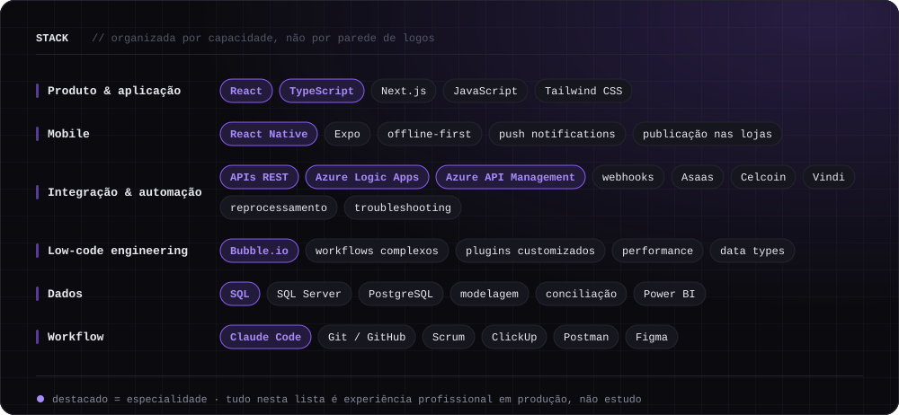

<div align="center">
  <picture>
    <source media="(prefers-color-scheme: dark)" srcset="./assets/header-pt-dark.svg" />
    <source media="(prefers-color-scheme: light)" srcset="./assets/header-pt-light.svg" />
    
  </picture>
</div>

<p align="center">
  <a href="https://igorsantos.dev/"></a>
  <a href="https://www.linkedin.com/in/igor-santos11"></a>
  <a href="mailto:igor.santos@mpdsconsultoria.com"></a>
  <a href="./README.en.md"></a>
  &nbsp;
  <a href="./.github/workflows/veracity.yml"></a>
  <a href="./.github/workflows/profile-assets.yml"></a>
</p>

---

## `whoami`

Construo e mantenho **sistemas reais em produção** há 5 anos, na interseção entre produto, integrações, automação e negócio. Nada aqui é protótipo de fim de semana: é software que precisa levantar segunda-feira de manhã, com dinheiro passando por dentro.

Trabalhei em sistemas empresariais e financeiros de alta criticidade — split de comissões, antecipação de recebíveis, emissão fiscal, integrações bancárias, cobrança recorrente — e em canais de venda enterprise como **Itaú, Unimed, Assaí e Pluxee**. Nesse contexto, integração quebrada e dado divergente têm impacto financeiro real. Por isso boa parte do meu trabalho acontece **antes** do código: entender o negócio, conversar com as áreas, priorizar, e sustentar o que já está rodando.

```yaml
onde:        São Paulo, Brasil 🇧🇷
agora:       Sócio @ MPDS · Software Engineer
mais forte:  Bubble.io · Azure (Logic Apps + APIM) · APIs REST · SQL · React / React Native
estudando:   Engenharia de Software @ Universidade São Judas Tadeu
certificado: AZ-900 · Bubble.io Specialist · Scrum Foundation · Banco de Dados (SQL)
aberto a:    Software Engineer · React / React Native · Integration · Automation · Solutions
```

---

## O que eu construo

O mesmo desenho se repete em quase todo projeto meu: **produto na ponta, camada de integração no meio, dinheiro e dados no fim.** É esse pedaço do mapa que eu domino.

<div align="center">
  <picture>
    <source media="(prefers-color-scheme: dark)" srcset="./assets/integrations-pt-dark.svg" />
    <source media="(prefers-color-scheme: light)" srcset="./assets/integrations-pt-light.svg" />
    
  </picture>
</div>

---

## Stack

<div align="center">
  <picture>
    <source media="(prefers-color-scheme: dark)" srcset="./assets/stack-pt-dark.svg" />
    <source media="(prefers-color-scheme: light)" srcset="./assets/stack-pt-light.svg" />
    
  </picture>
</div>

> Essa lista tem **CI**. Um workflow deste repositório reprova o build se o README apresentar como experiência profissional algo que, na minha carreira, foi só estudo ou contato pontual. Ver [`scripts/check-veracity.mjs`](./scripts/check-veracity.mjs).

---

## Projetos

<table>
<tr><td width="50%" valign="top">

### [Pipeimob](https://igorsantos.dev/projects/pipeimob)
**TRM integrado a Banco Digital**

Primeira plataforma TRM do Brasil integrada a Banco Digital — 400+ imobiliárias em 13 estados. Atuei em duas squads:

- **Banking** — split de comissão, antecipação de recebíveis e emissão fiscal em um produto que movimenta R$ 40MM/mês em comissões, onde erro é prejuízo, não bug.
- **Locações** — TRM ponta a ponta: contratos, cobrança recorrente, recibos e NFe, com integrações homologadas em cartórios de SP, RJ, SC e RS.

`Bubble.io` `plugins customizados` `APIs REST` `Asaas` `Celcoin`

</td><td width="50%" valign="top">

### [APet](https://igorsantos.dev/projects/apet)
**Portal de vendas enterprise + automação em Azure**

Plano de saúde pet. Entrei como desenvolvedor e virei o primeiro profissional fixo de uma área de TI que praticamente não existia.

- Conduzi o **SAV** (portal de vendas SaaS) ponta a ponta, usado por parceiros como Itaú, Unimed, Assaí e Pluxee.
- Integrações e automações em **Logic Apps + API Management**, no padrão de segurança exigido por um banco — foi isso que aprovou o canal.
- Power BI substituiu relatório em planilha por visão única de vendas, financeiro e reembolsos.

`Bubble.io` `Azure` `SQL` `Power BI` `Vindi` `Scrum`

</td></tr>
<tr><td width="50%" valign="top">

### [ECEM](https://igorsantos.dev/projects/ecem)
**Mentoria entre pares · voluntário**

Reforço gratuito que começou entre alunos da ETEC na pandemia e virou projeto multi-curso, com apoio da EACH USP. Cofundador, aluno mentor e tutor: aulas de lógica e desenvolvimento, campeonatos de programação e acompanhamento individual.

`ensino` `lógica de programação` `JavaScript`

</td><td width="50%" valign="top">

### [igorsantos.dev](https://igorsantos.dev)
**Portfólio bilíngue**

Next.js 16 + React 19, Tailwind v4, i18n PT/EN, animação com Motion e GSAP, Lenis, orçamento de performance de Lighthouse 95+ em todas as categorias. Cada projeto tem um estudo de caso próprio.

`Next.js` `React` `TypeScript` `Tailwind` `next-intl`

</td></tr>
</table>

---

## GitHub em números

<div align="center">
  <picture>
    <source media="(prefers-color-scheme: dark)" srcset="./assets/stats-pt-dark.svg" />
    <source media="(prefers-color-scheme: light)" srcset="./assets/stats-pt-light.svg" />
    
  </picture>
  <br /><br />
  <picture>
    <source media="(prefers-color-scheme: dark)" srcset="./assets/activity-pt-dark.svg" />
    <source media="(prefers-color-scheme: light)" srcset="./assets/activity-pt-light.svg" />
    
  </picture>
</div>

> **Sobre a conta ser de 2026:** perdi o acesso ao meu GitHub anterior, e os projetos que estavam lá foram junto. O histórico deste perfil começa em fevereiro — os 5 anos de trabalho, não. A linha tracejada no gráfico acima marca esse ponto.

> **Sobre a vitrine estar quase vazia:** a esmagadora maioria do meu código vive em repositório privado de cliente — sistema financeiro, portal de vendas enterprise, integração bancária. Não dá pra abrir, e eu prefiro ser honesto sobre isso a encher o perfil de fork. O que dá pra mostrar está em **[igorsantos.dev](https://igorsantos.dev)**, com estudo de caso escrito.

<div align="center">
  <picture>
    <source media="(prefers-color-scheme: dark)" srcset="https://raw.githubusercontent.com/igorpdsantos/igorpdsantos/output/github-contribution-grid-snake-dark.svg" />
    <source media="(prefers-color-scheme: light)" srcset="https://raw.githubusercontent.com/igorpdsantos/igorpdsantos/output/github-contribution-grid-snake.svg" />
    
  </picture>
</div>

---

## Como eu trabalho

<details>
<summary><b>🤖 AI-Assisted Software Engineering</b> — como eu uso Claude Code de verdade</summary>

<br />

Uso **Claude Code** diariamente como parte do workflow de engenharia: exploração de codebase, planejamento, implementação, debugging, refactoring, testes e documentação.

O que isso **não** significa: eu não me apresento como AI Engineer, ML Engineer nem especialista em LLM. Não treino modelo, não faço fine-tuning, não construo infra de IA.

O que isso **significa**: a responsabilidade pela solução, pela validação e pela entrega continua sendo minha. A ferramenta acelera a digitação e a leitura de código; ela não assume o risco de um split de comissão sair errado. Este próprio repositório é um exemplo — os painéis acima são SVGs gerados por scripts que eu mantenho, com CI de veracidade em cima do texto.

</details>

<details>
<summary><b>🔌 Por que integração é o meu lugar</b></summary>

<br />

Porque é onde o software encosta no negócio. Um endpoint que devolve 200 com o valor errado não quebra teste — quebra fechamento. Trabalhar em Banking e em portal de vendas enterprise me ensinou que:

- **erro de integração é silencioso** — precisa de reprocessamento, trilha e conferência, não só de try/catch;
- **dado divergente entre sistemas é o bug mais caro** — por isso escrevo muito SQL de conferência;
- **segurança é requisito de design, não etapa final** — criptografia, gestão de chaves, segregação de ambientes e auditoria desde o primeiro desenho;
- **a decisão sensível fica com a pessoa** — automatizei fila e análise de reembolso, mas a decisão permaneceu humana e auditável.

</details>

<details>
<summary><b>🛠️ Como este perfil é construído</b></summary>

<br />

Nenhum painel acima vem de serviço de terceiro. Todos são SVGs gerados por scripts deste repositório, com tema claro e escuro, `prefers-reduced-motion` respeitado e zero dependência de runtime:

| Workflow | O que faz |
| --- | --- |
| [`profile-assets.yml`](./.github/workflows/profile-assets.yml) | Roda [`scripts/build.mjs`](./scripts/build.mjs) todo dia, busca os dados na API do GitHub, regenera os 10 SVGs e comita só o que mudou. |
| [`veracity.yml`](./.github/workflows/veracity.yml) | Falha o build se o README apresentar como experiência algo que foi só estudo. |
| [`snake.yml`](./.github/workflows/snake.yml) | A cobrinha, porque nem tudo precisa ser sério. |

```bash
node scripts/build.mjs          # regenera todos os painéis
node scripts/check-veracity.mjs # roda o CI de veracidade localmente
```

</details>

<details>
<summary><b>📚 Formação, certificações e o que eu estudei mas não usei em produção</b></summary>

<br />

**Formação**
- Bacharelado em Engenharia de Software — Universidade São Judas Tadeu · 2023 – 2026 (em andamento)
- Técnico em Análise e Desenvolvimento de Sistemas — ETEC · 2020 – 2022
- Inglês — CNA Idiomas · 2014 – 2017

**Certificações**
- Microsoft Azure Fundamentals (AZ-900)
- Bubble.io Specialist
- Scrum Foundation Professional
- Banco de Dados — modelagem e SQL
- English Proficiency — CNA

<!-- veracity:knowledge -->
**Conheço, mas não apresento como experiência profissional**

Estudei e já mexi, sem ter entregue sistema em produção com isso: Node.js, Angular, Java e Spring / Spring Boot, microsserviços. Tive contato pontual com PHP em manutenção simples.

Está aqui porque é verdade e porque some contexto — não porque conta como bagagem. Se você precisa de alguém sênior nessas stacks, eu não sou a pessoa; se precisa de alguém que aprende rápido e já sustentou sistema crítico, provavelmente sou.
<!-- /veracity:knowledge -->

</details>

---

<div align="center">
  <sub>Feito em São Paulo · <a href="https://igorsantos.dev">igorsantos.dev</a> · sistemas que precisam funcionar todo dia</sub>
</div>
